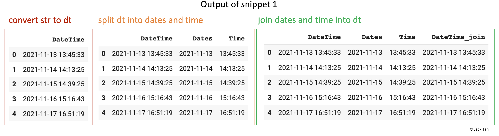
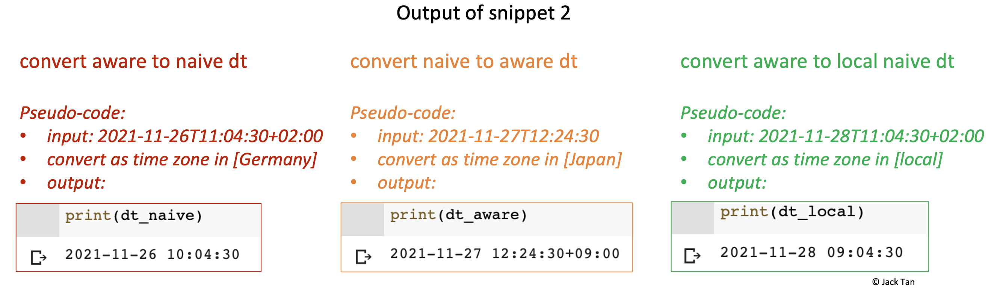
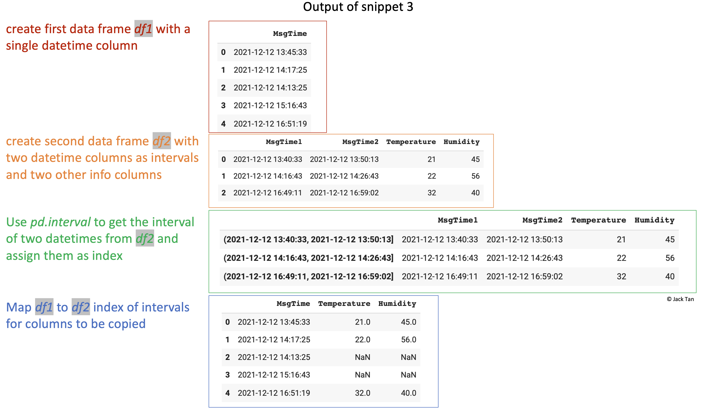

## Working with DateTime in Python

An example notebook on how to work with datetime in Python using *Pandas*, *Dateime*, *Pytz*, and *Tzlocal* 

A tutorial on this repo can be found on [Medium](https://towardsdatascience.com/how-to-work-with-datetime-in-python-26d4092dc484?sk=99c6cf075f37f016a86e87ba98922cf5).  

This Python notebook consists of 3 sectons:

- Snippet 1: Converting strings to datetime and vice versa 

- Snippet 2: Working with different timezones 

- Snippet 3: Conditionally compare different datetimes and do something 

